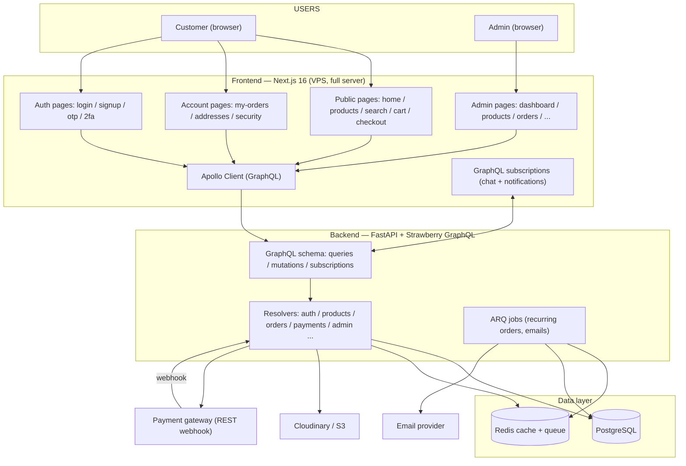
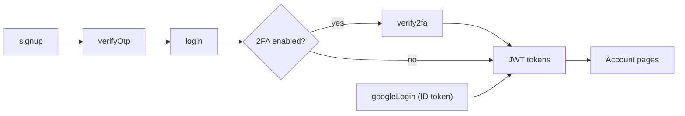
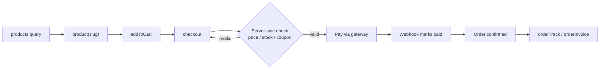
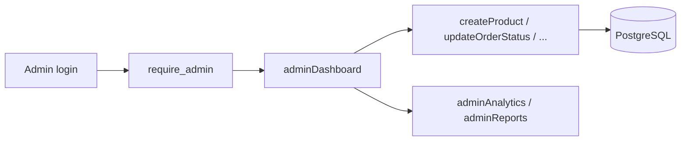

# PoojaPoint Backend (FastAPI)

FastAPI + Strawberry GraphQL backend for PoojaPoint — auth, catalog, cart, orders, payments, subscriptions, chat, notifications, and the admin API. This folder is currently **empty**; this README is the build plan and tool list.

## Flow Chart

### End-to-end system flow



### Auth flow (password + Google)



### Purchase flow



### Admin flow



## Stack / Tools

### Core
| Tool | Why |
| --- | --- |
| Python 3.12+ | Runtime |
| FastAPI | Web framework (async) |
| Strawberry GraphQL | GraphQL API — single `/graphql` endpoint (queries, mutations, subscriptions) |
| Uvicorn | ASGI server (`uvicorn app.main:app --reload`) |
| Pydantic v2 + `pydantic-settings` | Request validation + `.env` config |
| SQLAlchemy 2.0 (async) | ORM |
| Alembic | DB migrations |
| `asyncpg` | PostgreSQL async driver |
| Redis (`redis.asyncio`) | Cache, sessions, rate-limit counters |
| ARQ | Async job queue (emails, recurring subscription orders) |

### Auth & Security
| Tool | Why |
| --- | --- |
| PyJWT | Access/refresh tokens |
| `passlib[bcrypt]` | Password hashing (never plain text) |
| `pyotp` | TOTP for 2FA + signup OTP |
| `google-auth` | Verify Google ID tokens (OAuth) |
| `python-multipart` | File uploads |
| `slowapi` | Rate-limit login/signup/OTP/2FA |

### Integrations
| Tool | Why |
| --- | --- |
| `httpx` | Outbound calls: payment gateway, email provider |
| `cloudinary` | Product image storage |
| `aiosmtplib` (SMTP) | Email (OTP, order, invoice) — normal SMTP via `.env` (host/port/user/pass) |
| Strawberry subscriptions (WebSocket) | Real-time chat + notifications via GraphQL |

### Testing & Quality
| Tool | Why |
| --- | --- |
| `pytest`, `pytest-asyncio` | Tests |
| `httpx` AsyncClient | Test the ASGI app in-process |
| `pytest-cov` | Coverage |
| `ruff` | Lint + format |
| `mypy` | Type checking |

### Infra (VPS)
| Tool | Why |
| --- | --- |
| PostgreSQL 16 | Primary store |
| Redis 7 | Cache + queue broker |
| Docker + `docker-compose.yml` | Full stack: nginx + frontend + backend + worker + postgres + redis |
| Nginx | Reverse proxy / TLS |

## Project Layout (planned)

```text
backend/
├── README.md
├── pyproject.toml            deps, ruff, mypy config
├── .env.example              all secrets, no real values
├── docker-compose.yml        postgres + redis + api + worker
├── alembic/                  migrations
├── app/
│   ├── main.py               FastAPI app, GraphQL router mount, CORS, lifespan
│   ├── config.py             pydantic-settings
│   ├── db.py                 async engine + session
│   ├── redis.py              redis client + cache helpers
│   ├── deps.py               get_db, get_current_user, require_admin
│   ├── models/               SQLAlchemy models (one file per domain)
│   ├── graphql/              Strawberry schema: types, queries, mutations, subscriptions
│   ├── services/             business logic (payments, orders, otp)
│   ├── jobs/                 ARQ worker + tasks
│   └── seed.py               dev seed data
└── tests/
    ├── conftest.py           test DB, client fixture
    └── test_*.py             per-domain tests
```

## API — GraphQL

Single endpoint: `POST /graphql` (and `WS /graphql` for subscriptions). No REST routes except the payment webhook and media upload.

### Queries
| Query | Returns |
| --- | --- |
| `products(filter, page)` | Product list (search, category, status) |
| `product(slug)` | One product |
| `categories` | Category tree |
| `cart` | Current user's cart |
| `wishlist` | Current user's wishlist |
| `orders` | Current user's orders |
| `order(id)` | One order (ownership-checked) |
| `orderTrack(id)` / `orderInvoice(id)` | Tracking / invoice |
| `subscriptionPlans` | Subscription plans |
| `notifications` | Current user's notifications |
| `adminDashboard` / `adminAnalytics` / `adminReports` | Admin metrics (admin only) |
| `adminCustomers` / `adminIpActivity` / `adminSettings` | Admin data (admin only) |

### Mutations
| Mutation | Action |
| --- | --- |
| `signup(name, email, phone, password)` | Create pending account, send OTP |
| `verifyOtp(code)` | Activate account |
| `login(email, password)` | Password login → tokens |
| `verify2fa(code)` | Complete 2FA |
| `refreshToken` | New access token |
| `logout` | End session |
| `googleLogin(idToken)` | Google OAuth (ID token) |
| `addToCart` / `updateCartItem` / `removeCartItem` | Cart |
| `addToWishlist` / `removeFromWishlist` | Wishlist |
| `checkout(addressId, couponCode, paymentMethod)` | Create order (server-side validation) |
| `updateOrderStatus(id, status)` | Admin fulfillment |
| `createProduct` / `updateProduct` / `deleteProduct` | Admin catalog |
| `createCategory` / `updateCategory` / `deleteCategory` | Admin categories |
| `createCoupon` / `updateCoupon` / `deleteCoupon` | Admin coupons |
| `subscribe(planId, productId)` / `updateSubscription` | Subscriptions |
| `sendChatMessage` / `markChatRead` | Chat |
| `markNotificationRead` | Notifications |
| `updateSettings` | Admin settings |

### Subscriptions
| Subscription | Event |
| --- | --- |
| `chatMessage(conversationId)` | New chat message (customer ↔ admin) |
| `notification` | New notification for the user |

### REST (kept only for external integrations)
| Route | Purpose |
| --- | --- |
| `POST /payments/webhook` | Payment gateway callback — source of truth for paid |
| `POST /media/upload` | Image upload → Cloudinary/S3 URL |

## Setup

```bash
cd backend
python -m venv .venv
.venv\Scripts\activate          # Windows
pip install -e ".[dev]"
cp .env.example .env            # fill in secrets
alembic upgrade head
uvicorn app.main:app --reload   # http://localhost:8000/graphql (GraphiQL)
```

## Security Rules (from frontend READMEs)

- Hash passwords; never store plain text.
- Verify Google ID tokens server-side (signature + audience) — never trust the frontend.
- HTTP-only, SameSite session/JWT cookies where possible.
- Rate-limit login, signup, OTP, 2FA.
- Generic credential errors — no account enumeration.
- Validate everything at the API boundary.
- Backend recalculates totals + validates stock at checkout — never trust the browser.
- Payment webhooks, not redirects, set paid status.
- Admin endpoints require `require_admin`; order detail requires ownership.
- Limit GraphQL query depth/complexity; enforce auth in every resolver.
- Secrets (DB, Redis, JWT, payment) live only in `.env`.

## Deployment: VPS

Docker Compose runs the whole stack on one VPS: Nginx (TLS) → Next.js + FastAPI + ARQ worker, with PostgreSQL + Redis.

### Layout
- `nginx` → reverse proxy, TLS, serves frontend + `/graphql`
- `frontend` → Next.js server (Docker)
- `backend` → FastAPI + Strawberry GraphQL (Docker)
- `worker` → ARQ worker (recurring subscription orders, emails)
- `postgres` + `redis` → data + cache/queue
- Cloudinary → product images

### Migration path
None needed — VPS from day one. PostgreSQL, Redis, ARQ, WebSockets all available.

## Testing

```bash
pytest
```

Minimum: one smoke test per domain + auth/ownership tests for orders and admin.