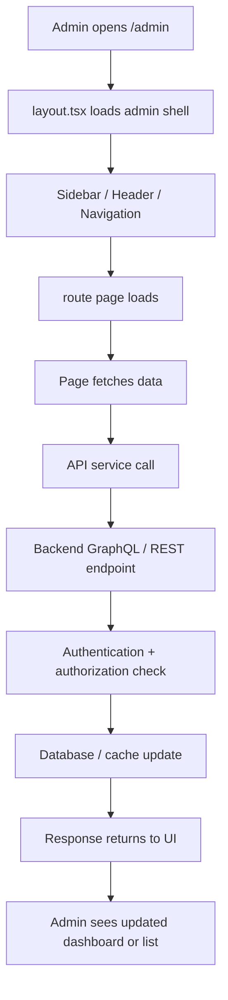
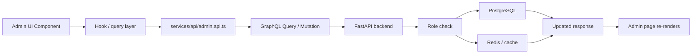

# Admin Architecture Flow

This document explains the flow of the admin module in the PoojaPoint frontend and how the admin pages connect to data, routes, and business logic.

## 1. Admin Entry Flow



## 2. Route Structure

```text
frontend/app/admin/
├── analytics/                 Analytics pages
├── categories/                Category management pages
├── chat/                      Chat and support pages
├── components/                Reusable admin UI components
├── coupons/                   Coupon management pages
├── customers/                 Customer pages and views
├── hero/                      Hero/banner management pages
├── ip-address/                Security and IP activity pages
├── layout.tsx                 Shared admin layout shell
├── logs/                      Logs and activity tracking pages
├── orders/                    Order management pages
├── page.tsx                   Dashboard home
├── page.test.tsx              Dashboard tests
├── products/                  Product management pages
├── reports/                   Report pages
├── reviews/                   Review moderation pages
├── settings/                  Store configuration pages
├── styles/                    Admin-specific styling
├── wishlist/                  Wishlist overview pages
├── README.md                  Admin overview document
├── README1.md                 This flow document
```

## 2.1 Current Implementation Check

The current admin module has moved beyond the initial static scaffold:

- `layout.tsx` is a thin shell and loads `./styles/admin_style.css`.
- `page.tsx` renders `AdminDashboard` from `./components/AdminDashboard`.
- There are dedicated admin component groups under `components/`.
- Styling is being organized under `styles/` instead of being embedded inside page files.
- Supporting sections such as `logs/` and `styles/` show the admin area is actively expanding.

This means the admin flow is not just a static route map anymore — it is a modular admin app with separate UI, section pages, and styles.

## 3. Admin Page Lifecycle

```mermaid
flowchart LR
    A[Browser request] --> B[Next.js app router]
    B --> C[Admin layout wrapper]
    C --> D[Protected admin page]
    D --> E[Load page component]
    E --> F[Call hooks / data fetchers]
    F --> G[Validate session]
    G --> H{Is admin?}
    H -->|Yes| I[Fetch admin data]
    H -->|No| J[Redirect / unauthorized]
    I --> K[Render connected UI]
    K --> L[User updates record]
    L --> M[Mutation request]
    M --> N[Backend validates & saves]
    N --> O[UI refreshes data]
```



## 4. Data / Service Flow



## 5. Admin Responsibilities

| Admin Area | Purpose |
| --- | --- |
| Dashboard | Overview of orders, revenue, and activity |
| Products | Add, edit, publish, and remove items |
| Categories | Organize product catalog |
| Orders | View lifecycle status and fulfillment |
| Customers | Track accounts and important customer data |
| Coupons | Create promotions and discount logic |
| Reviews | Moderate ratings and comments |
| Reports | Export insights and operational metrics |
| Settings | Store preferences and configuration |
| Chat | Support conversations and messaging |
| IP Address | Security and access monitoring |
| Wishlist | Customer interest tracking |
| Hero | Home page highlight and campaign management |

## 6. Security Flow

```text
Admin user -> Login -> Session validation -> Role check -> Permission gate -> API call -> DB action
```

Important security rules:

- Only authenticated admins should access admin routes.
- Role verification must happen on the server, not only in the UI.
- Sensitive customer or order data should be filtered by permission.
- Mutation requests should always validate input before writing to the database.
- Protected admin pages should redirect or deny unauthorized access.

## 7. Recommended Architecture Pattern

```text
UI Layer
  -> app/admin/* pages
  -> components/admin/*
  -> hooks/useAdmin* or shared data hooks

Service Layer
  -> services/api/*.ts
  -> GraphQL / REST client functions

Business Layer
  -> Backend resolvers / API endpoints
  -> auth + admin guards
  -> validation + DB logic

Data Layer
  -> PostgreSQL
  -> Redis cache
  -> ARQ jobs / background tasks
```

## 8. Implementation Guidance

1. Keep the admin shell in `app/admin/layout.tsx`.
2. Keep each route focused on one admin domain.
3. Put API calls in dedicated service files instead of inside components.
4. Centralize admin auth checks in backend guards.
5. Fetch and display data with server-aware hooks or Apollo/GraphQL queries.
6. Use form-based CRUD flows for products, categories, coupons, settings, and hero content.
7. Ensure all mutations update UI state after successful backend confirmation.

## 9. Recent Changes Check

The admin folder has recently expanded to include:

- new route groups for `logs`, `styles`, and feature-specific management folders
- shared component structure under `components/`
- split presentation styling from page logic
- a dashboard entry point using a dedicated `AdminDashboard` component

This is a sign the project is transitioning from a mock admin scaffold to a more real application structure.

## 10. Summary

The admin module works as a protected app section with a shared shell, separate route pages, service-layer API calls, and backend validation. The real flow is:

Admin browser -> protected route -> authenticated admin check -> API request -> backend validation -> database update -> UI refresh.

This keeps the admin area modular, secure, and scalable as the project grows.
